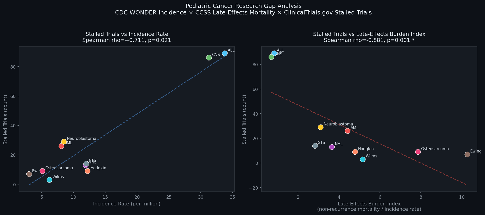
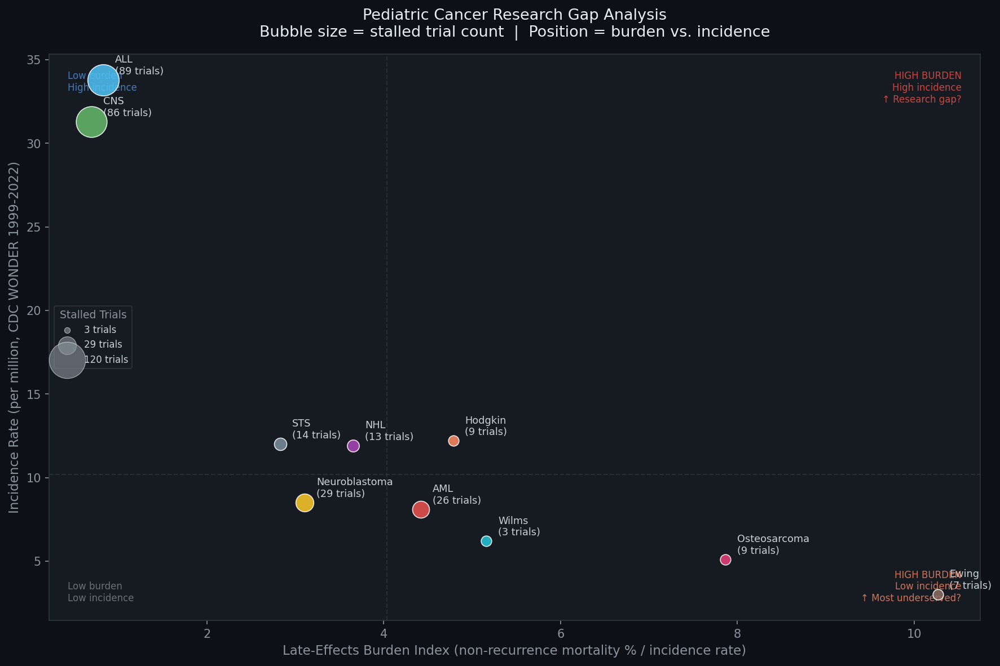

# Pediatric Cancer Research Gap Analysis

### Does research investment align with survivor harm?

**Research Question:**  
Is pediatric cancer research activity aligned with late-effects burden, 
or does it primarily track disease incidence?

**Finding:**  
Research activity tracks incidence (rho=+0.711, p=0.021), not late-effects 
burden (rho=-0.881, p=0.001). The more disproportionate the survivor harm 
relative to incidence, the fewer stalled trials exist. Rare cancers with 
high survivor burden are systematically underrepresented in the research 
pipeline.

---

## Data Sources

| Source | Description | Coverage |
|--------|-------------|----------|
| [CDC WONDER](https://wonder.cdc.gov/) | Age-adjusted incidence rates per million | 1999–2022 |
| [CCSS Mortality Tables](https://ccss.stjude.org/) | Non-recurrence cause-of-death % by cancer type | St. Jude Jan 2020 freeze, NDI through 12/31/2017 |
| [ClinicalTrials.gov](https://github.com/DataInfamous/pediatric-cancer-stalled-trials) | 950 terminated/withdrawn/suspended pediatric cancer trials | 1995–present |

---

## Key Results

| Cancer Type | Incidence (per M) | Non-Recurrence Mortality (%) | Stalled Trials | Burden Index |
|-------------|-------------------|------------------------------|----------------|--------------|
| Ewing Sarcoma | 3.0 | 30.8 | 7 | 10.3 |
| Osteosarcoma | 5.1 | 40.1 | 9 | 7.9 |
| Wilms Tumor | 6.2 | 32.0 | 3 | 5.2 |
| Hodgkin Lymphoma | 12.2 | 58.4 | 9 | 4.8 |
| ALL | 33.8 | 28.0 | 89 | 0.8 |
| CNS | 31.3 | 21.8 | 86 | 0.7 |

*Burden Index = non-recurrence mortality % / incidence rate*

---

## Visualizations

---

## Methods

Three-variable correlation analysis using Spearman rank correlation (n=10 
disease categories). Stalled trials categorized from title keywords; 66% 
of 950 trials could not be categorized and are excluded. Analysis conducted 
with AI assistance (Claude, Anthropic).

**Limitations:**
- Title-keyword categorization excludes 66% of trials; condition tag API 
  query would improve accuracy
- CCSS aggregate tables only; individual-level data requires AOI submission
- n=10 categories is small for correlation analysis
- Temporal mismatch: CCSS through 2017, CDC WONDER through 2022, trials 
  1995–present
- Raw stalled counts favor high-incidence diseases; stall *rate* would be 
  a stronger metric

---

## Related Work

The stalled trial counts used here are derived from 
[pediatric-cancer-stalled-trials](https://github.com/DataInfamous/pediatric-cancer-stalled-trials), 
which characterizes 950 terminated, withdrawn, and suspended pediatric 
cancer trials across 89 countries — including geographic distribution, 
sponsor type, and reason for stopping.

---

## Citation

Wilson, B. (2026). *Pediatric Cancer Research Gap Analysis: CDC WONDER 
Incidence × CCSS Late-Effects Mortality × ClinicalTrials.gov Stalled 
Trials.* GitHub. https://github.com/DataInfamous/pediatric-cancer-research-gaps

**Data Sources:**
- United States Cancer Statistics - Incidence: 1999–2022, WONDER Online 
  Database. CDC/NCI; 2025 release.
- Childhood Cancer Survivor Study (CCSS). St. Jude Children's Research 
  Hospital. Jan 2020 data freeze, NDI through 12/31/2017.
- ClinicalTrials.gov API v2. U.S. National Library of Medicine.

---

*Author: Benjamyn Wilson | [DataInfamous](https://github.com/DataInfamous)*

pediatric-cancer-research-gaps/

├── README.md

├── pediatric_research_gap_analysis.ipynb
 ├── pediatric_research_gap_results.csv
└── images/
    ├── scatter_plots.png
    └── bubble_chart.png
