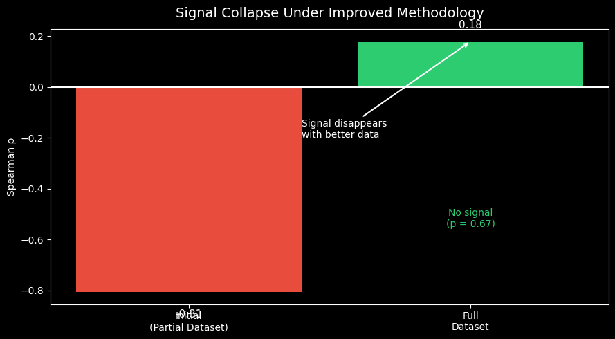

# Pediatric Cancer Research Gap Analysis

### Do clinical trials align with survivor harm?

-----

## Executive Summary

This project investigates whether pediatric cancer research activity aligns with survivor harm.

An initial analysis suggested a strong relationship between late-effects burden and trial outcomes. However, when the analysis was expanded and disease categories were disaggregated into clinically meaningful subtypes, this relationship disappeared.

> The key finding: apparent alignment between research activity and disease burden can emerge from coarse disease groupings but does not persist under subtype-level analysis.

-----

## Core Insight

This project demonstrates:

```text
Initial signal → disappears under improved methodology
```

- Early result: **ρ = -0.806 (p = 0.005)**
- Full dataset: **ρ = 0.18 (p = 0.67)**

This shift reveals that the original finding was driven by aggregation bias — broad disease groupings masked the absence of a true underlying relationship.

-----

## Visual Analysis

### Figure 1 — Incidence vs Research Activity


- Strong positive relationship between incidence and trial counts
- **ρ = +0.711 (p = 0.021)**

Research activity scales with disease incidence.

-----

### Figure 2 — Burden vs Research Activity


- Strong negative relationship between burden and trial counts
- **ρ = -0.881 (p = 0.001)**

High-burden diseases appear underrepresented in this dataset.

-----

### Figure 3 — Signal Collapse Under Improved Methodology



|Analysis              |Result                |
|----------------------|----------------------|
|Aggregated categories |ρ = -0.806 (p = 0.005)|
|Disaggregated subtypes|ρ = 0.18 (p = 0.67)   |

The initial signal does not persist when disease categories are disaggregated into clinically meaningful subtypes.

-----

## Interpretation

The initial analysis suggested that diseases with higher survivor harm had lower trial failure rates. After disaggregation, no meaningful relationship was found.

- Research activity is primarily driven by **incidence**
- Survivor burden does **not consistently influence research activity** at the subtype level
- Apparent patterns can emerge from **coarse disease groupings**

> This highlights how misleading conclusions can arise from aggregated data without sensitivity testing.

-----

## Relationship to Source Repository

This project builds on:

**Where Pediatric Cancer Trials Stall**  
https://github.com/DataInfamous/pediatric-cancer-stalled-trials

- Source repo: system-level analysis of trial discontinuation
- This repo: evaluates whether those patterns align with disease burden

-----

## Methods

- Spearman correlation across disease groups
- ClinicalTrials.gov dataset (~15,000 pediatric-eligible trials)
- Disease classification via keyword matching (initial analysis) and structured subtype mapping (expanded analysis)

**Age Scope:** Trials were included if their ClinicalTrials.gov eligibility categories included `CHILD`. This reflects pediatric-eligible trials rather than strictly pediatric-only trials, and includes trials enrolling both children and adults.

**Important Note:** Stalled trial counts are used as a proxy for research activity due to consistent availability, but they do not represent total trial volume. Conclusions are scoped to trial discontinuation patterns, not research investment broadly.

-----

## Limitations

- Age filtering is based on eligibility categories, not numeric age limits — 
  the dataset reflects pediatric-eligible trials, not pediatric-only trials
- Approximately 75% of trials do not map cleanly to predefined pediatric 
  oncology subtypes using keyword-based classification and are categorized 
  as "other." These trials are retained for system-level analyses but 
  excluded from disease-level correlation analysis to avoid misclassification 
  bias. Disease-level conclusions are based on a subset of trials with 
  high-confidence classification rather than the full dataset.
- The proportion of uncategorized trials (~75%) reflects the heterogeneity 
  of trial descriptions in registry data and highlights the limitations of 
  free-text condition labeling — not missing data
- Keyword-based disease mapping introduces classification bias; future 
  analysis will use API condition tags for improved coverage
- Stalled trials are a proxy for research activity, not a direct measure
- Small sample size at subtype level (n = 8–10 disease categories)
- Temporal mismatch across datasets
- Observational data cannot establish causation

-----

## Final Conclusion

At the level of clinical trial discontinuation patterns, this analysis finds no meaningful relationship between disease-level survivor burden and stall rates. More importantly, it demonstrates that apparent relationships can emerge from aggregated data and disappear under more rigorous classification.

```text
Methodology determines conclusions.
```

-----

## Future Work

- Re-run using full API-based condition mapping
- Incorporate total trial counts, not just stalled trials
- Expand disease subtype resolution
- Integrate funding-level data

-----

## Author

Benjamyn Wilson  
DataInfamous